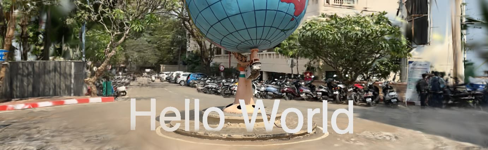
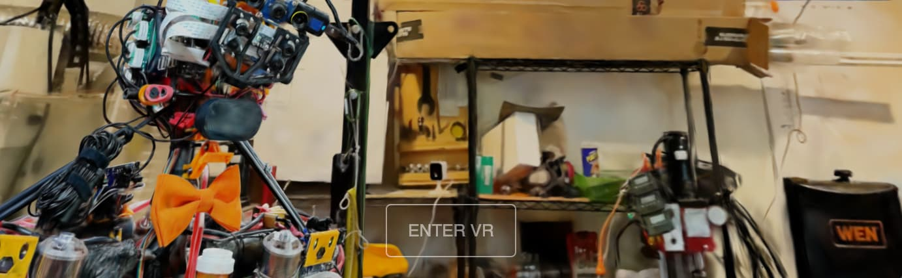

# [](https://lumalabs.ai) Luma WebGL Examples

`luma-web` is a [npm package](https://www.npmjs.com/package/luma-web) for rendering photoreal interactive scenes captured by the [Luma app](https://lumalabs.ai/). It includes `LumaSplatsWebGL`, which is a WebGL-only gaussian splatting implementation designed to be integrated with 3D frameworks, and `LumaSplatsThree`, which is a Three.js implementation that uses `LumaSplatsWebGL` under the hood. For these examples we'll use [Three.js](https://threejs.org/).

### Contents
- [Getting Started](#getting-started)
- [Background Removal](#background-removal)
- [Three.js Fog](#three.js-fog)
- [Scene Lighting](#scene-lighting)
- [Custom Shaders](#custom-shaders)
- [React Three Fiber](#react-three-fiber)
- [Transparency](#transparency)
- [VR](#vr)

## Getting Started
[](#getting-started)

To get started, install the package:

```bash
npm install @lumai/luma-web
```

And import the `LumaSplatsThree` class:

```ts
import { LumaSplatsThree } from "luma-web";
```

Or if using a browser, include the script:

```html
<script src="https://unpkg.com/@lumai/luma-web"></script>
```

Then in your code, import the `LumaSplatsThree` class, create an instance with a source, and add it to your scene.

`source` can be either of:
- URL to a capture on [lumalabs.ai](https://lumalabs.ai)
- path to a luma splats file or folder containing a luma splats artifacts

**[DemoHelloWorld.ts](./src/DemoHelloWorld.ts)**
```ts
let splats = new LumaSplatsThree({
	source: 'https://lumalabs.ai/capture/ca9ea966-ca24-4ec1-ab0f-af665cb546ff',
});

scene.add(splats);

scene.add(createText());
```

Splats will integrate with the three.js rendering pipeline and interact with other objects via depth testing. However, splats do not currently write to the depth buffer themselves.

### Performance tips

- Use `antialias: false` when creating the renderer to disable MSAA on the canvas. Splats are already anti-aliased and the high instance count in splats is expensive to render with MSAA
- Set `enableThreeShaderIntegration: false` to disable integration with the three.js rendering pipeline. This will disable features like fog and tone mapping, but will improve performance

## Background Removal
[](#background-removal)

Luma scenes can include multiple semantic layers. By default, all layers are rendered. To filter layers, use the `semanticsMask` property. This is a bit mask, so for example, to show only the foreground layer, set `semanticsMask = LumaSplatsSemantics.FOREGROUND`. To show both foreground and background, set `semanticsMask = LumaSplatsSemantics.FOREGROUND | LumaSplatsSemantics.BACKGROUND`

**[DemoBackgroundRemoval.ts](./src/DemoBackgroundRemoval.ts)**
```ts
import { LumaSplatsSemantics, LumaSplatsThree } from "luma-web";

let splats = new LumaSplatsThree({
	source: 'https://lumalabs.ai/capture/1b5f3e33-3900-4398-8795-b585ae13fd2d',
});

scene.add(splats);

// filter splats to only show foreground layers
splats.semanticsMask = LumaSplatsSemantics.FOREGROUND;
```

## Three.js Fog
[](#three.js-fog)

Luma splats integrate with the three.js rendering pipeline including features like tone mapping, color spaces and fog. Ensure `enableThreeShaderIntegration` is set to `true` (the default) and set the scene fog

**[DemoFog.ts](./src/DemoFog.ts)**
```ts
scene.fog = new FogExp2(new Color(0xe0e1ff).convertLinearToSRGB(), 0.15);
scene.background = scene.fog.color;
```

## Scene Lighting
[](#scene-lighting)

It's possible to illuminate three.js scenes with Luma splats. To do so, we can render a cubemap of the splats and use it as the scene environment. This is done by calling `captureCubeMap` on the splats object. We first wait for the splats to fully load before capturing the cubemap. To ensure the splats are fully rendered at the time of capture, we disable the loading animation.

**[DemoLighting.ts](./src/DemoLighting.ts)**
```ts
let splats = new LumaSplatsThree({
	source: 'https://lumalabs.ai/capture/4da7cf32-865a-4515-8cb9-9dfc574c90c2',

	// disable loading animation so model is fully rendered after onLoad
	loadingAnimationEnabled: false,
});

splats.onLoad = () => {
	let capturedTexture = splats.captureCubeMap(renderer);
	scene.environment = capturedTexture;
	scene.background = capturedTexture;
	scene.backgroundBlurriness = 0.5;
}
```

## Custom Shaders
[](#custom-shaders)

You can inject code into the splat shaders to customize them. To do this, call `setShaderHook({ ... })` on your splat and provide GLSL functions, uniforms and globals to override default behavior. For example, in this demo we apply a transform matrix to each splat by setting the vertex shader hook `getSplatTransform`. It generates a transform matrix for time-varying sinusoidal offset to the y coordinate.

The syntax for shader hook function is a GLSL function without a function name. The GLSL function arguments and return are given as documentation on the shader hook fields (see below).

**[DemoCustomShaders.ts](./src/DemoCustomShaders.ts)**
```ts
splats.setShaderHooks({
	vertexShaderHooks: {
		additionalUniforms: {
			time_s: ['float', uniformTime],
		},

		getSplatTransform: /*glsl*/`
			(vec3 position, uint layersBitmask) {
				// sin wave on x-axis
				float x = 0.;
				float z = 0.;
				float y = sin(position.x * 1.0 + time_s) * 0.1;
				return mat4(
					1., 0., 0., 0,
					0., 1., 0., 0,
					0., 0., 1., 0,
					x,  y,  z, 1.
				);
			}
		`,
	}
});
```

### Shader Hook API
```typescript
type LumaShaderHooks = {

	/** Hooks added to the vertex shader */
	vertexShaderHooks?: {
		additionalUniforms?: { [name: string]: [UniformTypeGLSL, { value: any }] },

		/** Inject into global space (for example, to add varying) */
		additionalGlobals?: string,

		/**
		 * Example `(vec3 splatPosition, uint layersBitmask) { return mat4(1.); }`
		 * @param {vec3} splatPosition, object-space
		 * @param {uint} layersBitmask, bit mask of layers, where bit 0 is background and bit 1 is foreground
		 * @returns {mat4} per-splat local transform
		 */
		getSplatTransform?: string,

		/**
		 * Executed at the end of the main function after gl_Position is set
		 * 
		 * Example `() {
		 *  vPosition = gl_Position;
		 * }`
		 * @returns {void}
		 */
		onMainEnd?: string,

		/**
		 * Example `(vec4 splatColor, vec3 splatPosition) { return pow(splatColor.rgb, vec3(2.2), splatColor.a); }`
		 * Use `gl_Position` is available
		 * @param {vec4} splatColor, default splat color
		 * @param {vec3} splatPosition, object-space
		 * @param {uint} layersBitmask, bit mask of layers, where bit 0 is background and bit 1 is foreground
		 * @returns {vec4} updated splat color
		 */
		getSplatColor?: string,
	},

	/** Hooks added to the fragment shader */
	fragmentShaderHooks?: {
		additionalUniforms?: { [name: string]: [UniformTypeGLSL, { value: any }] },

		/** Inject into global space (for example, to add varying) */
		additionalGlobals?: string,

		/**
		 * Example `(vec4 fragColor) { return tonemap(fragColor); }`
		 * @param {vec4} fragColor, default fragment color
		 * @returns {vec4} updated fragment color
		 */
		getFragmentColor?: string,
	}
}
```

## React Three Fiber
[](#react-three-fiber)

Luma splats can be used with [React Three Fiber](https://docs.pmnd.rs/), a React renderer for Three.js. To do so, we need to extend R3F to include the `LumaSplatsThree` class. This is done by calling `extend` with the class and a name (in this case `LumaSplats` which will be used as the component name). If using TypeScript, we also need to declare the component type.

**[DemoReactThreeFiber.tsx](./src/DemoReactThreeFiber.tsx)**
```typescript
import { Object3DNode, extend } from '@react-three/fiber';
import { LumaSplatsThree } from 'luma-web';

// Make LumaSplatsThree available to R3F
extend( { LumaSplats: LumaSplatsThree } );

// For typeScript support:
declare module '@react-three/fiber' {
  interface ThreeElements {
    lumaSplats: Object3DNode<LumaSplatsThree, typeof LumaSplatsThree>
  }
}

function Scene() {
	return <lumaSplats
		semanticsMask={LumaSplatsSemantics.FOREGROUND}
		source='https://lumalabs.ai/capture/822bac8d-70d6-404e-aaae-f89f46672c67'
		position={[-1, 0, 0]}
		scale={0.5}
	/>
}
```

## Transmission
[](#transmission)

Splats can be used in combination with three.js transmission effects, however some care should be taken to make this work. Splats are considered `transparent` materials in three.js which means by default they're not rendered in the transmissive pass, so initially you won't see your splats in transmissive materials. To fix we set `splats.material.transparent = false;`.

In this example, we draw two splat scenes, one inside a refractive globe and the other outside. To make this work, we want the inner splat scene to _only_ render to the transmission buffer and to to the canvas. We do this by checking the render target before rendering and selectively disabling.

**[DemoTransmission.tsx](./src/DemoTransmission.tsx)**
```typescript
// inner splat
let globeSplats = new LumaSplatsThree({
	// Chateau de Menthon - Annecy
	source: 'https://lumalabs.ai/capture/da82625c-9c8d-4d05-a9f7-3367ecab438c',
	enableThreeShaderIntegration: true,
	onBeforeRender: (renderer) => {
		// disable MSAA on render targets (in this case the transmission render target)
		// this improves splatting performance
		let target = renderer.getRenderTarget();
		if (target) {
			target.samples = 0;
		}

		// only render in targets and not the canvas
		globeSplats.preventDraw = target == null;
	}
});

// disable transparency so the renderer considers it an opaque object
// opaque objects are rendered in the transmission pass (whereas transparent objects are not)
globeSplats.material.transparent = false;

scene.add(globeSplats);

// outer splat
let environmentSplats = new LumaSplatsThree({
	// Arosa Hörnli - Switzerland
	source: 'https://lumalabs.ai/capture/4da7cf32-865a-4515-8cb9-9dfc574c90c2',
	// disable animation for lighting capture
	loadingAnimationEnabled: false,
	// disable three.js shader integration for performance
	enableThreeShaderIntegration: false,
});

scene.add(environmentSplats);

// add a refractive transmissive sphere
let glassSphere = new Mesh(
	new SphereGeometry(1, 32, 32),
	new MeshPhysicalMaterial({
		roughness: 0,
		metalness: 0,
		transmission: 1,
		ior: 1.341,
		thickness: 1.52,
		envMapIntensity: 1.2,
		clearcoat: 1,
		side: FrontSide,
		transparent: true,
	})
);

scene.add(glassSphere);
```

## VR
[](#vr)

Viewing your splats in VR is as simple as enabling XR in three.js and adding a VR button

**[DemoVR.tsx](./src/DemoVR.tsx)**
```typescript
import { VRButton } from "three/examples/jsm/webxr/VRButton.js";

renderer.xr.enabled = true;

let vrButton = VRButton.createButton(renderer);

document.body.appendChild(vrButton);

let splats = new LumaSplatsThree({
	// Kind Humanoid @RyanHickman
	source: 'https://lumalabs.ai/capture/83e9aae8-7023-448e-83a6-53ccb377ec86',
});

scene.add(splats);
```

View this demo with a VR headset (or through a headset browser) and click "Enter VR"! It will work best on PC VR, standalone VR tends to struggle with splats presently
